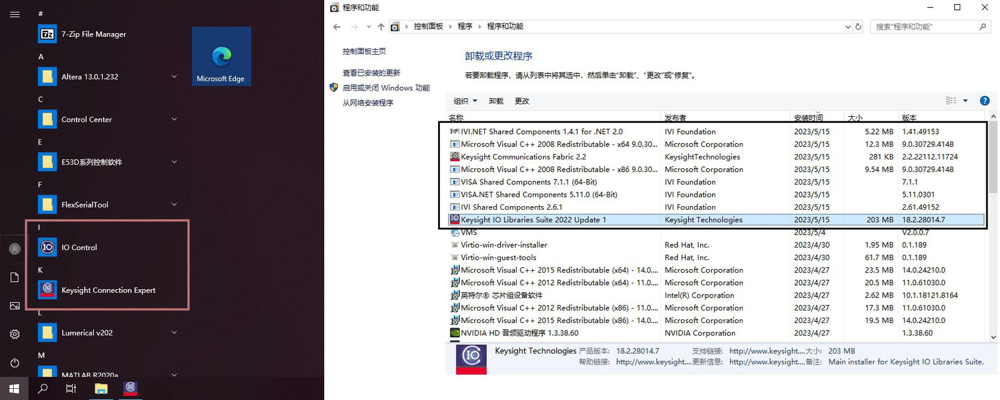

# 网络资源

## VISA
[VISA-HELP](https://documentation.help/NI-VISA/Help_File_Title.html)

[VISA常用函数参照.pdf](https://max.book118.com/html/2021/1019/5232124133004033.shtm)

[VISA事件机制的分析_设计与实现.pdf](https://www.docin.com/p-756225522.html)

[VISA协议](https://www.ivifoundation.org/specifications/)

## keysight
[IVI 仪器驱动概述](https://edadocs.software.keysight.com/kkbopen/ivi-instrument-drivers-overview-589741125.html)

[82357B USB/GPIB 接口高速 USB 2.0 技术支持](https://www.keysight.com.cn/cn/zh/support/82357B/usb-gpib-interface-high-speed-usb-2-0.html#faq)

[惠普的手册](http://www.hp70000.com/manuals/)

<br>
<br>

# 本地资源
## 文件结构
```
VISA
│  Readme.md                    //资料整理
│  vpp43_2022-05-19.pdf         //visa函数说明
│
├─70004A                        //存放关于70004A显示器的各种手册，并不是很重要
│      9018-07880.pdf
│      9018-07881.pdf
│      HP-70004A说明书一.pdf
│      HP-70004A说明书二.pdf
│      HP-70004A说明书三.pdf
│
├─70952B(71452B)                //有关70952B光谱仪的文档，70952B光谱仪是71452B的一部分
│      5151_71450B.pdf          //71452B设备参数
│      70950-90047.pdf          //比较齐全的手册，主要关于设备硬件操作
│      70950-90049.pdf
│      70950-90050.pdf
│      70950-90052.pdf          //带编程指令的手册
│      70950-90070.pdf
│      HP714510B-1B-2B光谱仪编程指南.pdf //重要的编程指南
│
├─82357B                        //有关82357B USB/GPIB 转换接口的文档
│      9018-06141.pdf           //快速入门指南
│      9018-06142.pdf           //更加详细的用户手册
│
├─img
│      1.jpg
```


## 软件安装
1. 在[此处](https://www.keysight.com.cn/cn/zh/lib/software-detail/computer-software/io-libraries-suite-downloads-2175637.html)下载IO程序库套件，得到`IOLibSuite_18_2_28014.exe`
2. 双击安装，一直“下一步”即可，耗时稍久。
3. 安装完成后，可以看到控制面板和开始菜单中多了如下软件：
4. Keysight Connection Expert就是需要的软件。
